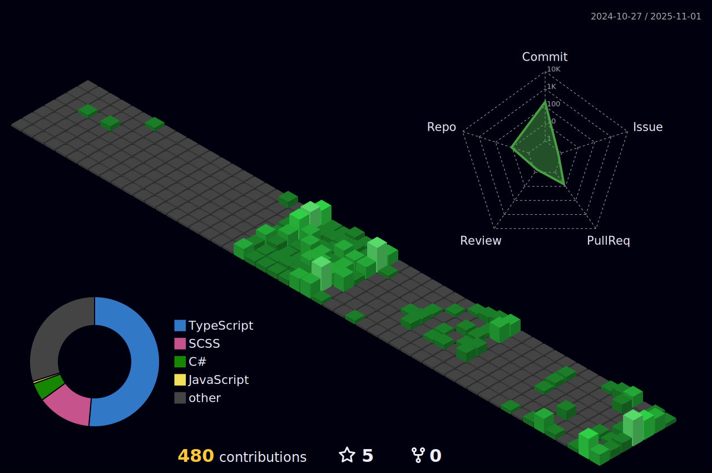

###

For almost a decade now, I’ve been helping law enforcement agencies operate more effectively and safely by creating smart, secure, and performance-driven software. 
Real-world uses that most excite me include using AI for data-backed decisions plus report and workflow automation. 
I work to build some AI solutions for use in high-stakes environments. 
Accountability along with trust including innovation all matter most in this work.

###

## Things I code with

  
  
  
  
  
  
  
  
  
  
  
  
  
  
  
  
  
  
  
  
  
  
  
  
  
  
  
  
  
  
  
  
  
  
  
  
  
  
  
  
  
  
  
  
  
  
  
  
  
  
  
  
  
  
  
  
  
  
  
  
  
  
  
  
  
  
  
  
  
  
  
  
  
  
  
  
  
  
  
  
  
  
  
  
  
  
  
  
  
  
  
  
  
  
  
  
  
  
  
  
  
  
  
  
  
  
  
  
  
  
  
  
  
  
  
  
  
  
  
  
  
  
  
  
  
  
  
  
  
  
  
  
  
  
  
  
  

###
## Contact me

  
  
  
  
  

###

###

###

  
  

###

<h3 align="center">Statistics</h3>

<a href="https://github.com/sameerkali">

  
###

## GitHub Stats

<table><tbody><tr border="none"><td width="50%" align="center">

</td>
<td width="50%" align="center">
</td></tr></tbody></table>

##

###

  

##

###

  

###

 

###

<picture>
  <source media="(prefers-color-scheme: dark)" srcset="https://raw.githubusercontent.com/itsarisid/itsarisid/output/pacman-contribution-graph-dark.svg">
  <source media="(prefers-color-scheme: light)" srcset="https://raw.githubusercontent.com/itsarisid/itsarisid/output/pacman-contribution-graph.svg">
  
</picture>

###

###

###
